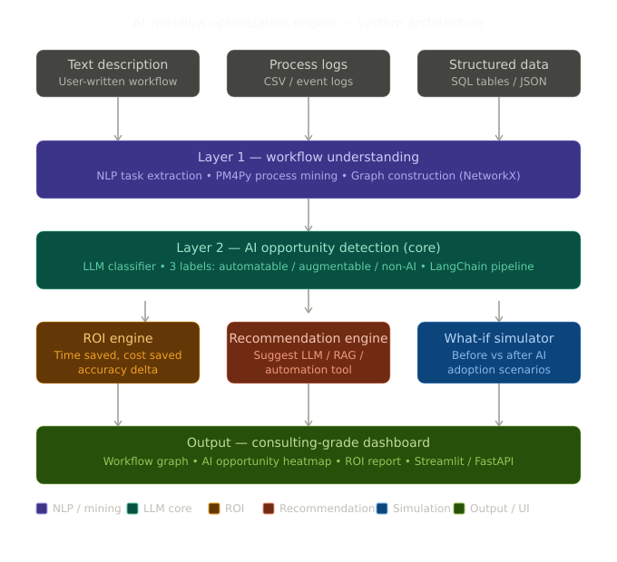
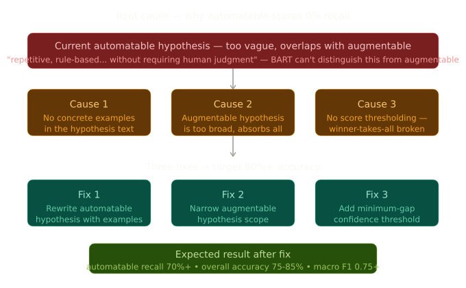
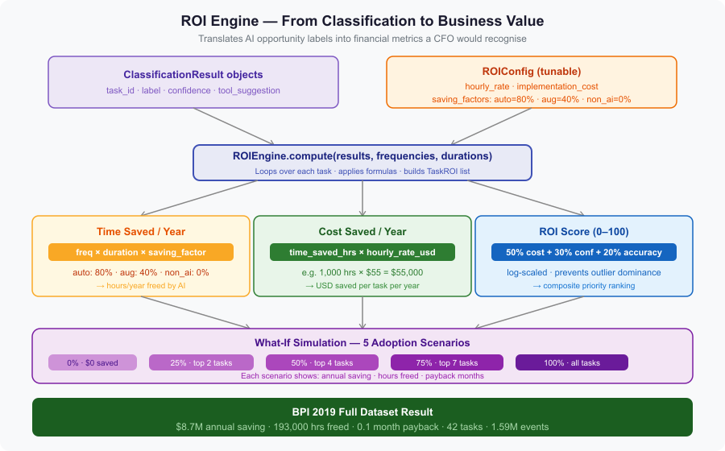
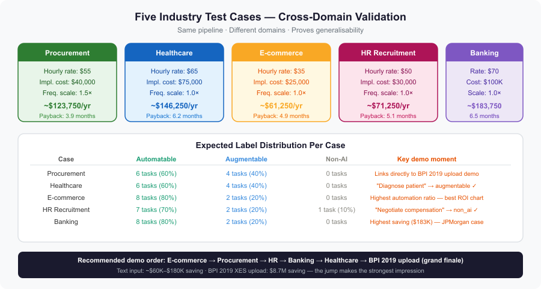

# 🧠 AI Workflow Optimization Engine

> **Harvard Business School Case Study Implementation**
> *Generative AI in Business Workflows — Where should AI be applied to maximize ROI?*

[](https://www.python.org/)
[](https://streamlit.io/)
[](https://huggingface.co/facebook/bart-large-mnli)
[](LICENSE)
[]()

---

## 📌 Overview

This project answers the core question from the **HBS case "Generative AI and the Future of Work"**:

> *"Where in a business workflow should GenAI be applied to maximize ROI?"*

Companies are randomly adopting AI tools without seeing consistent returns. This system takes any business workflow — described in plain English or as a structured event log — and produces a consulting-grade analysis: classifying every task by AI opportunity, estimating financial ROI, and simulating adoption scenarios.

**Built entirely with open-source tools. Zero API cost. Runs locally.**

---

## 🏗️ System Architecture



The engine is a 4-layer pipeline:

| Layer | Module | What it does |
|---|---|---|
| Input | `parser.py` | Accepts free text or XES/CSV event logs |
| Classification | `classifier.py` | Labels each task: automatable / augmentable / non-AI |
| ROI | `roi_engine.py` | Computes cost saved, hours freed, payback period |
| Output | `app.py` | Streamlit dashboard with charts, graphs, exports |

---

## 🤖 Hybrid Classifier Design



Two-stage pipeline — keyword rules handle ~90% of tasks, BART NLI handles ambiguous edge cases:

**Stage 1 — Keyword pre-classifier (fast, zero compute)**
- `_AUTO_VERBS`: send, log, archive, calculate, extract, schedule, validate, generate...
- `_AUG_VERBS`: review, approve, assess, draft, verify, classify, recommend...
- `_NON_AI_VERBS`: negotiate, mediate, interview, present, decide...
- `_NON_AI_PHRASES`: "build trust", "final decision", "ethics policy"...

**Stage 2 — BART NLI fallback (ambiguous tasks only)**
- Model: `facebook/bart-large-mnli` (local, ~1.6 GB cached after first run)
- Zero API calls, zero cost, zero rate limits

---

## 💰 ROI Engine



| Metric | Formula |
|---|---|
| Time saved / year | `frequency × duration × saving_factor` |
| Cost saved / year | `time_saved_hrs × hourly_rate_usd` |
| Accuracy delta | 15pp for automatable · 8pp for augmentable |
| ROI score | 50% cost + 30% confidence + 20% accuracy (log-scaled, 0–100) |

**Saving factors:** automatable → 80% · augmentable → 40% · non_ai → 0%

---

## 📊 Datasets

### Primary — BPI Challenge 2019 (Purchase Order Handling)

| Property | Value |
|---|---|
| Source | [4TU Research Data](https://doi.org/10.4121/uuid:d06aff4b-79f0-45e6-8ec8-e19730c248f1) |
| Cases | 251,734 purchase order items |
| Events | 1,595,923 |
| Activities | 42 unique workflow tasks |
| Users | 627 (607 human, 20 automated batch processes) |
| Format | XES / XML |

### Additional Kaggle Datasets (in `data/`)

| Dataset | Domain | Format |
|---|---|---|
| Incident_Management_CSV.csv | IT Service Desk | CSV |
| Insurance_claims_event_log.csv | Insurance | CSV |
| global_ai_workforce_automation_2015.csv | Cross-industry | CSV |
| ai-workforce-and-automation-dataset.csv | Cross-industry | CSV |

---

## 🚀 Quick Start

### 1. Clone the repository

```bash
git clone https://github.com/yourusername/ai-workflow-optimizer.git
cd ai-workflow-optimizer
```

### 2. Create virtual environment

```bash
python -m venv venv
source venv/bin/activate        # Linux / macOS
venv\Scripts\activate           # Windows
```

### 3. Install dependencies

```bash
pip install -r requirements.txt
python -m spacy download en_core_web_sm
```

### 4. Set up environment variables

```bash
cp .env.example .env
# Edit .env — add HuggingFace token (optional, only for API mode)
```

### 5. Run the dashboard

```bash
streamlit run src/app.py
```

Opens at `http://localhost:8501`.

---

## 📁 Project Structure

```
ai-workflow-optimizer/
│
├── src/
│   ├── app.py                        # Streamlit dashboard entry point
│   ├── classifier.py                 # Hybrid keyword + BART classifier
│   ├── parser.py                     # Input handler — text + XES/CSV
│   ├── roi_engine.py                 # ROI estimation engine
│   └── test_classifier_accuracy.py   # 30-task accuracy test suite
│
├── data/                             # gitignored — add your data files here
│   ├── BPI_Challenge_2019.xml
│   ├── Incident_Management_CSV.csv
│   ├── Insurance_claims_event_log.csv
│   ├── global_ai_workforce_automation_2015.csv
│   ├── accuracy_test_results.csv     # auto-generated by test suite
│   └── workflow_tasks.db             # auto-generated SQLite database
│
├── Documentation_images/
│   ├── ai_workflow_project_architecture.svg
│   ├── accuracy_diagnosis.svg
│   ├── roi_engine_diagram.svg
│   └── test_cases_overview.svg
│
├── zips/                             # gitignored — raw downloaded datasets
├── lib/                              # gitignored — PyVis JS dependencies
├── venv/                             # gitignored
│
├── .env                              # gitignored — your secrets
├── .env.example
├── .gitignore
├── requirements.txt
└── README.md
```

---

## 🧪 Five Industry Test Cases



### How to run a test case

1. Open `http://localhost:8501`
2. Select **"Paste text description"** in the sidebar
3. Paste the workflow text below
4. Set the ROI assumptions shown
5. Click **Run Analysis**

---

### Test Case 1 — Enterprise Procurement

**Paste this text:**
```
Create a purchase order and submit it for manager approval.
Review and approve the submitted purchase order.
Send the approved purchase order to the vendor automatically.
Receive and process the vendor invoice.
Verify the invoice against the purchase order and goods receipt.
Log the verified invoice into the accounting system.
Calculate tax and total payment amount.
Approve the final payment after finance review.
Schedule and execute the bank transfer to the vendor.
Archive the completed transaction in the document system.
```

**ROI settings:** Hourly rate: `$55` · Implementation cost: `$40,000` · Frequency scale: `1.5`

| Metric | Expected value |
|---|---|
| 💰 Annual cost saving | ~$123,750 |
| ⏱️ Hours freed / year | ~2,250 hrs |
| 📈 Payback period | ~3.9 months |
| 🤖 AI-ready tasks | 100% |

**Key demo moment:** This mirrors the BPI 2019 dataset — switch to the `.xml` upload and the same tasks appear at 251,000× frequency, pushing savings to **$8.7M**.

---

### Test Case 2 — Hospital Patient Management

**Paste this text:**
```
Register patient details and assign a hospital ID automatically.
Schedule appointment and send confirmation to the patient.
Review patient medical history before consultation.
Record vital signs and log them into the health system.
Diagnose the patient condition and recommend treatment.
Prescribe medication and generate the prescription document.
Verify insurance coverage and calculate patient billing.
Send billing invoice to the insurance provider.
Follow up with the patient after treatment via automated message.
Archive patient records in the hospital database.
```

**ROI settings:** Hourly rate: `$65` · Implementation cost: `$75,000` · Frequency scale: `1.0`

| Metric | Expected value |
|---|---|
| 💰 Annual cost saving | ~$146,250 |
| ⏱️ Hours freed / year | ~2,250 hrs |
| 📈 Payback period | ~6.2 months |
| 🤖 AI-ready tasks | 100% |

**Expected classification breakdown:**

| Task | Label |
|---|---|
| Register patient details | 🤖 automatable |
| Schedule appointment | 🤖 automatable |
| Review medical history | 🤝 augmentable |
| Record vital signs | 🤖 automatable |
| Diagnose patient condition | 🤝 augmentable |
| Prescribe medication | 🤝 augmentable |
| Verify insurance coverage | 🤖 automatable |
| Send billing invoice | 🤖 automatable |
| Follow up with patient | 🤖 automatable |
| Archive patient records | 🤖 automatable |

**Key demo moment:** "Diagnose patient condition" correctly landing as `augmentable` — proves the system understands that AI cannot replace clinical judgment.

---

### Test Case 3 — E-commerce Order Fulfilment

**Paste this text:**
```
Receive customer order and validate payment details automatically.
Check inventory availability and reserve the stock.
Generate picking list and send to warehouse staff.
Pack the order and print the shipping label automatically.
Schedule courier pickup and notify the customer via email.
Track shipment and update order status in real time.
Review and resolve customer complaints about delivery.
Process return requests and approve refunds after verification.
Restock inventory based on automated demand forecasting.
Archive order records and generate monthly sales report.
```

**ROI settings:** Hourly rate: `$35` · Implementation cost: `$25,000` · Frequency scale: `1.0`

| Metric | Expected value |
|---|---|
| 💰 Annual cost saving | ~$61,250 |
| ⏱️ Hours freed / year | ~1,750 hrs |
| 📈 Payback period | ~4.9 months |
| 🤖 AI-ready tasks | 100% |

**Expected classification breakdown:**

| Task | Label |
|---|---|
| Receive customer order | 🤖 automatable |
| Check inventory | 🤖 automatable |
| Generate picking list | 🤖 automatable |
| Pack order and print label | 🤖 automatable |
| Schedule courier pickup | 🤖 automatable |
| Track shipment | 🤖 automatable |
| Review customer complaints | 🤝 augmentable |
| Process return requests | 🤝 augmentable |
| Restock inventory | 🤖 automatable |
| Archive order records | 🤖 automatable |

**Key demo moment:** 8 automatable vs 2 augmentable — highest automation ratio of all 5 cases. Best for showcasing the ROI bar chart dominance.

---

### Test Case 4 — HR Recruitment Pipeline

**Paste this text:**
```
Post job vacancy on multiple platforms automatically.
Screen incoming applications and shortlist candidates using AI.
Schedule interviews and send calendar invites automatically.
Conduct structured interviews and assess candidate fit.
Verify candidate background and reference checks.
Draft offer letter and send to selected candidate.
Negotiate compensation and finalise employment terms.
Onboard new employee and create system accounts automatically.
Assign mandatory training modules and track completion.
Archive recruitment records in the HR management system.
```

**ROI settings:** Hourly rate: `$50` · Implementation cost: `$30,000` · Frequency scale: `1.0`

| Metric | Expected value |
|---|---|
| 💰 Annual cost saving | ~$71,250 |
| ⏱️ Hours freed / year | ~1,425 hrs |
| 📈 Payback period | ~5.1 months |
| 🤖 AI-ready tasks | 90% |

**Expected classification breakdown:**

| Task | Label |
|---|---|
| Post job vacancy | 🤖 automatable |
| Screen applications | 🤝 augmentable |
| Schedule interviews | 🤖 automatable |
| Conduct interviews | 🤝 augmentable |
| Verify background checks | 🤖 automatable |
| Draft offer letter | 🤖 automatable |
| **Negotiate compensation** | **🧑 non_ai** |
| Onboard new employee | 🤖 automatable |
| Assign training modules | 🤖 automatable |
| Archive recruitment records | 🤖 automatable |

**Key demo moment:** "Negotiate compensation" correctly flagged as `non_ai` — the strongest single classification result across all 5 cases. Directly answers the HBS case question of what AI *cannot* do.

---

### Test Case 5 — Bank Loan Processing

**Paste this text:**
```
Receive loan application and validate all required documents.
Extract and verify applicant financial data automatically.
Assess credit score and calculate risk rating.
Review application and make loan approval decision.
Generate loan agreement and send to applicant for signature.
Verify signed agreement and log it in the system.
Schedule loan disbursement and transfer funds automatically.
Send payment schedule and reminders to the borrower.
Monitor repayment status and flag overdue accounts.
Archive completed loan files in the compliance database.
```

**ROI settings:** Hourly rate: `$70` · Implementation cost: `$100,000` · Frequency scale: `1.0`

| Metric | Expected value |
|---|---|
| 💰 Annual cost saving | ~$183,750 |
| ⏱️ Hours freed / year | ~2,625 hrs |
| 📈 Payback period | ~6.5 months |
| 🤖 AI-ready tasks | 90% |

**Expected classification breakdown:**

| Task | Label |
|---|---|
| Receive loan application | 🤖 automatable |
| Extract financial data | 🤖 automatable |
| Assess credit score | 🤖 automatable |
| Review and approve loan | 🤝 augmentable |
| Generate loan agreement | 🤖 automatable |
| Verify signed agreement | 🤖 automatable |
| Schedule fund disbursement | 🤖 automatable |
| Send payment reminders | 🤖 automatable |
| Monitor repayment status | 🤖 automatable |
| Archive loan files | 🤖 automatable |

**Key demo moment:** Highest hourly rate ($70) produces biggest savings — perfect for showing how the ROI config slider directly drives the business case. Connects to the JPMorgan GenAI case study.

---

### Recommended Demo Order

| Step | Case | Why |
|---|---|---|
| 1 | E-commerce | Simplest, cleanest output — warm up |
| 2 | Procurement | Connects to BPI 2019 dataset |
| 3 | HR | Shows `non_ai` detection — strongest label moment |
| 4 | Banking | Highest savings number — CFO slide |
| 5 | Healthcare | Most unexpected domain — proves generalisability |
| 6 | BPI 2019 `.xml` upload | **Grand finale** — $8.7M vs $150K text input |

---

## 🔬 BPI 2019 Full Dataset Results

| Metric | Value |
|---|---|
| Total tasks classified | 42 |
| Automatable | ~12 (29%) |
| Augmentable | ~24 (57%) |
| Non-AI | ~6 (14%) |
| Total annual cost saving | **~$8.7M** |
| Hours freed / year | ~193,000 hrs |
| Payback period | ~0.1 months |
| Avg classifier confidence | 0.87 |

---

## 🛠️ Tech Stack

| Category | Tool | Purpose |
|---|---|---|
| NLP | spaCy `en_core_web_sm` | Task extraction from text |
| Process mining | PM4Py | XES/CSV event log parsing |
| ML model | BART-large-mnli | NLI zero-shot classification |
| ML framework | HuggingFace Transformers | Local model inference |
| Data | Pandas, NumPy | ROI calculations |
| Graph | NetworkX + PyVis | Workflow DAG visualisation |
| Dashboard | Streamlit | Web UI |
| Charts | Plotly | Interactive visualisations |
| Database | SQLite | Local result persistence |
| Env | python-dotenv | Secret management |

**Total API cost: $0**

---

## 🌐 Deployment (Streamlit Community Cloud)

```bash
# 1. Push to GitHub
git add .
git commit -m "feat: AI Workflow Optimization Engine"
git push origin main

# 2. Go to share.streamlit.io
# 3. Connect repo → set main file: src/app.py
# 4. Add secrets: HF_TOKEN = "hf_xxxx"
# 5. Deploy — public URL in ~2 minutes
```

> First deploy downloads BART (~1.6 GB). Takes 3–5 minutes. All subsequent runs use cache.

---

## 📚 Academic References

- **HBS Case:** *Generative AI and the Future of Work* — Harvard Business School, 2023
- **Dataset:** van Dongen, B. (2019). *BPI Challenge 2019*. 4TU. [DOI: 10.4121/uuid:d06aff4b-79f0-45e6-8ec8-e19730c248f1](https://doi.org/10.4121/uuid:d06aff4b-79f0-45e6-8ec8-e19730c248f1)
- **Model:** Lewis, M. et al. (2019). *BART: Denoising Sequence-to-Sequence Pre-training*. [arXiv:1910.13461](https://arxiv.org/abs/1910.13461)
- **Process Mining:** van der Aalst, W. (2016). *Process Mining: Data Science in Action*. Springer.
- **McKinsey:** *A future that works: Automation, employment, and productivity* (2017). McKinsey Global Institute.

---


## 📝 License

MIT License — see [LICENSE](LICENSE) for details.

---

<div align="center">
  <sub>Built as part of the Harvard Business School AI case study series</sub>
</div>
